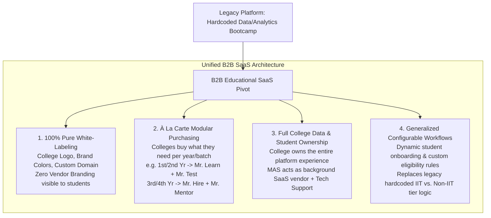
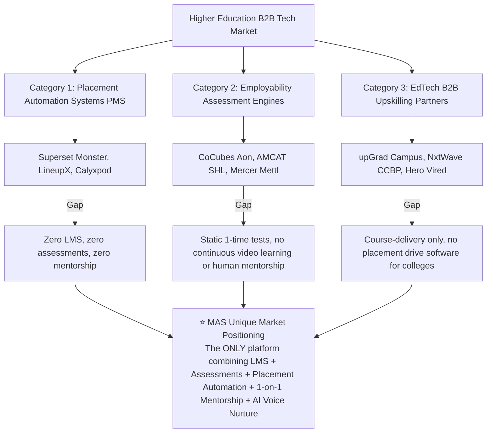

# Executive Master Project Summary: MAS B2B Educational SaaS Platform

**Project Title**: Strategic Pivot & Product Architecture Specification for the Generalized Multi-Tenant MAS B2B Educational SaaS Platform  
**Organization**: My Analytics School (MAS)  
**Author**: AI Product Manager Intern  
**Internship Start Date**: August 10, 2026  
**Document Status**: Official Master Project Summary  

---

## 📌 Executive Summary

This master summary document details the end-to-end product strategy, competitive positioning, user journey mapping, and UI/UX design specifications for transforming **My Analytics School (MAS)** from a legacy Data/Business Analytics bootcamp platform into a **100% white-labeled, highly configurable B2B Educational SaaS platform**.

The generalized platform empowers any higher education institution (universities, engineering colleges, degree institutes) to deploy an all-in-one digital campus under their own institutional branding. Colleges can purchase and configure the 4 core modular building blocks (**Mr. Learn**, **Mr. Test**, **Mr. Hire**, **Mr. Mentor**) à la carte based on their specific student cohort needs.

---

## 🎯 Strategic Product Vision & Key Decisions



---

## 🧩 The 4 Core Modular Building Blocks

The generalized platform decouples core functionality into 4 independent, highly configurable product modules:

| Module Name | Core Capability | Integrations / Backend Engine | Key Features |
| :--- | :--- | :--- | :--- |
| 📘 **Mr. Learn** | Video LMS & Course Roadmaps | Graphy LMS API (`/api/graphy`) | Course catalog, video player, progress auto-sync, automated WhatsApp progress reminders. |
| 📝 **Mr. Test** | Examinations & Assessments | EzExam API (`/api/ezexam`) | Aptitude & technical exams, live webcam proctoring, scorecards, prerequisite course threshold gating ($\ge 75\%$). |
| 💼 **Mr. Hire** | Campus Recruitment & Placements | Internal Placement Engine | Job drive publishing, candidate eligibility checker (CGPA/branch/backlogs), application tracking, recruiter portal. |
| 🤝 **Mr. Mentor** | 1-on-1 Industry Mentorship | `SlotCompletionService.ts` | Token credit quota ledger, slot escrow reservation, post-call scorecard settlement, +50 XP payout, mentor leaderboards. |

---

## 📊 Market Competitor Landscape & MAS Positioning

Exhaustive competitive analysis across Indian Higher EdTech revealed 3 fragmented competitor categories:



---

## 🏛️ UI/UX Design System & Layout Architecture

The user interface has been designed with a **professional, university-first aesthetic** (eliminating consumer bootcamp fluff):

```
+---------------------------------------------------------------------------------------------------+
|  [TOP HEADER]  [College Logo]                 [🔍 Global Search...]          [🔔 (3)]  [👤 Avatar] |
+---------------------------------------------------------------------------------------------------+
|  [LEFT SIDEBAR]   |  MIDDLE CANVAS AREA                                            (Profile/Set.) |
|                   |                                                                               |
|  • Dashboard      |  Zone 1: Student Academic Profile Summary Banner                              |
|  • My Courses     |  Zone 2: Action-Oriented Focus Cards (Today's Schedule, Pending Tests, Drives)|
|  • Examinations   |  Zone 3: Placement Eligibility Radar & Skill Proficiency Matrix               |
|  • Placements     |  Zone 4: Official College TPO Noticeboard & Contact Support Strip             |
|  • Mentorship     |                                                                               |
|                   |-------------------------------------------------------------------------------|
|  (Cleaned up)     |  [FOOTER] Copyright © College Name | Terms | Support                          |
|                   |                                                            [ ✨ AI Assistant ] |
+-------------------+-------------------------------------------------------------------------------+
```

### Key UI/UX Principles:
1. **Deduplicated Top-Right Navigation**: `My Profile`, `Settings`, and `Account Preferences` are consolidated strictly into the **Top-Right Avatar Dropdown Menu**.
2. **Action-Oriented Focus Cards**: Directs students to immediate priorities (*Resume Learning ➔*, *Take Exam ➔*, *Apply to Drive ➔*).
3. **Placement Eligibility Live Radar**: Live checkmarks (`CGPA Criteria Met`, `Attendance Met`, `Zero Backlogs`, `Resume Verified`) giving 100% transparency on campus drive eligibility.
4. **AI Assistance**: Non-intrusive floating action button (`✨ Aarya AI`) at the bottom right.

---

## 📂 Complete Documentation Repository

All architectural specifications, daily work logs, and UI/UX design documents are stored in the project workspace:

### 1. Daily AI PM Work Logs (`pm_logs/`)
- 📄 [`Master Log Index (LOG_INDEX.md)`](file:///Users/yashvi/Documents/MAS%20-%20AI%20PM/pm_logs/LOG_INDEX.md)
- 📝 [`Day 01 Log: Onboarding`](file:///Users/yashvi/Documents/MAS%20-%20AI%20PM/pm_logs/2026-08-10_Day_01_Onboarding.md)
- 📝 [`Day 02 Log: B2B SaaS Mandate & Baseline Specs`](file:///Users/yashvi/Documents/MAS%20-%20AI%20PM/pm_logs/2026-08-11_Day_02_Platform_Architecture_and_Student_Journey.md)
- 📝 [`Day 03 Log: Admin/CRM Review & 2 Product Positions`](file:///Users/yashvi/Documents/MAS%20-%20AI%20PM/pm_logs/2026-08-12_Day_03_Mentor_Journey_and_PM_Log_System.md)
- 📝 [`Day 04 Log: Founder Alignment & Market Research`](file:///Users/yashvi/Documents/MAS%20-%20AI%20PM/pm_logs/2026-08-13_Day_04_Platform_Generalization_and_Dual_B2B_Model.md)
- 📝 [`Day 05 Log: User Journey Mapping`](file:///Users/yashvi/Documents/MAS%20-%20AI%20PM/pm_logs/2026-08-14_Day_05_User_Journeys_College_Admin_and_Student.md)

### 2. Technical Component Specifications (`docs/components/`)
- 📘 [`Master Component Index (INDEX.md)`](file:///Users/yashvi/Documents/MAS%20-%20AI%20PM/docs/INDEX.md)
- ⚙️ 10 Technical Specs: `student_dashboard.md`, `gamification_engine.md`, `roadmap_and_course_builder.md`, `sales_crm_and_aarya_ai.md`, `courses_and_modules.md`, `batch_management.md`, `mr_test_engine.md`, `mr_learn_lms.md`, `mentorship_and_mentor_experience.md`, `system_architecture_and_api.md`.

### 3. UI/UX Design System & Screen Specifications (`docs/ui_specs/`)
- 📐 [`Application Layout Architecture (layout.md)`](file:///Users/yashvi/Documents/MAS%20-%20AI%20PM/docs/ui_specs/layout.md)
- 🎨 [`Design System Tokens & Specs (design-system.md)`](file:///Users/yashvi/Documents/MAS%20-%20AI%20PM/docs/ui_specs/design-system.md)
- 🖥️ [`Screen Spec: Overview Dashboard (routes/student_dashboard_overview.md)`](file:///Users/yashvi/Documents/MAS%20-%20AI%20PM/docs/ui_specs/routes/student_dashboard_overview.md)
- 🖥️ [`Screen Spec: My Courses & Player (routes/student_my_courses.md)`](file:///Users/yashvi/Documents/MAS%20-%20AI%20PM/docs/ui_specs/routes/student_my_courses.md)
- 🖥️ [`Screen Spec: Assessments & Exams (routes/student_assessments.md)`](file:///Users/yashvi/Documents/MAS%20-%20AI%20PM/docs/ui_specs/routes/student_assessments.md)
- 🖥️ [`Screen Spec: Placement Drives (routes/student_placement_drives.md)`](file:///Users/yashvi/Documents/MAS%20-%20AI%20PM/docs/ui_specs/routes/student_placement_drives.md)
- 🖥️ [`Screen Spec: 1-on-1 Mentorship (routes/student_mentorship.md)`](file:///Users/yashvi/Documents/MAS%20-%20AI%20PM/docs/ui_specs/routes/student_mentorship.md)
- 🖥️ [`Screen Spec: Profile & Settings (routes/student_profile_settings.md)`](file:///Users/yashvi/Documents/MAS%20-%20AI%20PM/docs/ui_specs/routes/student_profile_settings.md)

---

## 📌 Open Points & Future Roadmap

1. **Pricing Model Finalization**: Evaluate flat annual institutional licensing vs. per-student per-year pricing vs. per-module pricing.
2. **Multi-Tenancy Database Architecture**: Finalize database isolation strategy (`x-tenant-id` middleware with TypeORM schema isolation).
3. **Onboarding & Implementation Tooling**: Design self-serve vs. MAS-guided institutional setup scripts for onboarding new college accounts.
