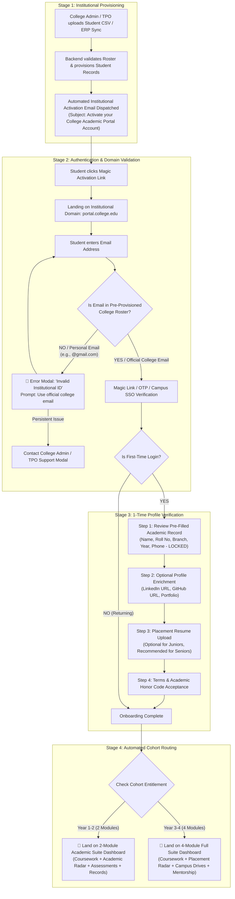

# White-Label Platform Feature Specifications & Gap Analysis

**Document Status**: `LIVING DOCUMENT`  
**Last Updated**: `2026-08-19`  
**Target Platform**: 100% Pure White-Label Academic & Career OS (`portal.college.edu`)  
**Legacy Reference**: MAS Retail / Bootcamp Platform (`myanalyticsschool.com`)

---

## 📑 Master Section Navigation
1. [Executive Summary & Framework](#1-executive-summary--framework)
2. [Journey 01: Student Onboarding, Authentication & Profile Setup](#2-journey-01-student-onboarding-authentication--profile-setup)
   - [2.1 End-to-End Visual Flowchart](#21-end-to-end-visual-flowchart)
   - [2.2 Feature Comparison & Gap Matrix](#22-feature-comparison--gap-matrix)
   - [2.3 Detailed Step-by-Step Functional Specifications](#23-detailed-step-by-step-functional-specifications)
   - [2.4 Failure Modes, Edge Cases & Resolution Protocols](#24-failure-modes-edge-cases--resolution-protocols)
3. [Module 01: Coursework & LMS Engine (Upcoming)](#3-module-01-coursework--lms-engine)
4. [Module 02: Assessments & Examination Engine (Upcoming)](#4-module-02-assessments--examination-engine)
5. [Module 03: Campus Recruitment & Placement Drives (Upcoming)](#5-module-03-campus-recruitment--placement-drives)
6. [Module 04: Mentorship & 1-on-1 Guidance (Upcoming)](#6-module-04-mentorship--1-on-1-guidance)
7. [Module 05: Platform Administration, RBAC & Analytics (Upcoming)](#7-module-05-platform-administration-rbac--analytics)

---

# 1. Executive Summary & Framework

This document serves as the master engineering and product specification defining the transition from the legacy MAS direct-to-consumer/bootcamp website to a **100% white-labeled, multi-tenant B2B Academic OS** sold to universities and colleges.

### Core Architectural Pillars:
* **Zero Vendor Leakage**: To the student, MAS does not exist. The platform is completely branded with institutional logos, colors, domain URLs, and dean circulars.
* **Controlled Access / Closed Roster**: Public self-registration is eliminated. Accounts exist only if pre-provisioned by the College Administration / TPO.
* **Modular Entitlement**: Automated cohort routing to the **2-Module Academic Suite** (Junior: Learn + Test) or **4-Module Full Suite** (Senior: Learn + Test + Hire + Mentor).

---

# 2. Journey 01: Student Onboarding, Authentication & Profile Setup

---

## 2.1 End-to-End Visual Flowchart

---

## 2.2 Feature Comparison & Gap Matrix

| Feature / Dimension | Legacy Platform (`myanalyticsschool.com`) | New White-Label Academic OS (`portal.college.edu`) | Gap Classification | Technical & UX Resolution |
| :--- | :--- | :--- | :--- | :--- |
| **Domain & Hosting** | Public domain `myanalyticsschool.com/student/dashboard`. | Custom institutional subdomain (e.g. `portal.iitd.ac.in`). | 🔴 **Net-New Architecture** | Multi-tenant reverse proxy router with automatic SSL provisioning. |
| **Branding & Visuals** | MAS logos, teal gradients, retail bootcamp marketing banners (*"MAS × IIMT"*). | 100% institutional branding (College crest, primary brand color, campus photo). Zero vendor mentions. | 🔴 **Net-New Architecture** | Dynamic theme tokens injected at runtime based on the accessing tenant subdomain. |
| **User Provisioning** | Public self-signup (`/auth/register`) open to anyone on the internet. | **Closed Roster**: Pre-provisioned exclusively by College Admin via CSV/ERP upload. | 🔴 **Critical Shift** | Public registration routes disabled. Only pre-seeded emails can initiate login. |
| **Domain Whitelisting** | Accepts personal emails (`@gmail.com`, `@yahoo.com`). | Strict institutional domain validation (must match college domain or pre-uploaded list). | 🔴 **Net-New Security** | Email validation middleware checking roster whitelist before OTP/token dispatch. |
| **First-Time Verification** | None. Direct drop into course selection. | **1-Time 30-Second Verification Flow**: Confirm pre-filled academic data, add optional links, upload resume. | 🔴 **Net-New UX** | Modal-based onboarding wizard flagged by `has_completed_onboarding: boolean`. |
| **Data Integrity Control** | Students can edit all profile fields (risk of fake names/grades). | **Dual-Tier Profile Security**: Core academic fields are locked; social/resume fields are student-editable. | 🔴 **Critical Enterprise Feature** | Immutable fields guarded at backend API schema level. Edits require Admin approval. |
| **Cohort Dashboard Routing** | Generic bootcamp catalog view. | Automated routing: Year 1-2 ➔ 2-Module Dashboard; Year 3-4 ➔ 4-Module Dashboard. | 🔴 **Net-New Architecture** | Batch entitlement engine configuring the 2x2 grid layout dynamically. |

---

## 2.3 Detailed Step-by-Step Functional Specifications

### Step 1: Bulk Institutional Provisioning (Admin Action)
1. The College Admin uploads a standardized CSV containing:
   - `First Name`, `Last Name`, `Institutional Email`, `Mobile Number`
   - `Roll Number / University ID`, `Branch / Department` (e.g. CSE, ECE, Mech)
   - `Degree Program` (e.g. B.Tech, M.Tech, MBA), `Graduation Year` (e.g. 2028), `Current Semester`
2. Backend creates student entities in `PENDING_ACTIVATION` state.
3. System sends an institutional invitation email with a secure 7-day magic token.

### Step 2: Authentication & Domain Validation
1. Student lands on `https://portal.<college>.edu/auth/login`.
2. Student enters their email address.
3. **Validation Logic**:
   - **Condition A (Domain / Roster Match)**: If email exists in the tenant's student roster, a 6-digit OTP or Magic Login Link is dispatched.
   - **Condition B (Non-Institutional / Unrecognized Email)**: Access blocked. An inline warning states:
     > *"Please use your official college email address. Personal email domains (@gmail.com, @yahoo.com) are not authorized."*
   - **Condition C (Unresolved Issue)**: A prominent `[ Need Help? Contact College Admin / TPO ]` button opens a pre-filled support ticket modal.

### Step 3: First-Time Onboarding Modal (1-Time Setup)
Upon first successful authentication, the student is presented with a 3-step modal wizard before accessing the dashboard:

#### 🔒 Screen 1: Verify Academic Record (Read-Only / Immutable)
Students inspect their official institution data pre-populated by the college. These fields **cannot be edited by the student**:
* **Full Name**: `Alex Morgan` *(Locked 🔒)*
* **Roll Number**: `2028CS042` *(Locked 🔒)*
* **Institutional Email**: `alex.morgan@college.edu` *(Locked 🔒)*
* **Registered Mobile**: `+91 98765 43210` *(Locked 🔒)*
* **Department & Degree**: `Computer Science & Engineering • B.Tech` *(Locked 🔒)*
* **Class of**: `2028 (Semester 4)` *(Locked 🔒)*
* *Disclaimer*: *"To correct official academic details, please submit a modification request to your TPO / College Admin."*

#### ✏️ Screen 2: Professional Links & Resume (Optional / Student-Editable)
Students enrich their profile for campus recruitment and AI recommendations:
* **LinkedIn URL** *(Optional — Input Field with `https://linkedin.com/in/...` placeholder)*
* **GitHub / Portfolio URL** *(Optional — Input Field with `https://github.com/...` placeholder)*
* **Placement Resume PDF** *(Optional for Year 1-2, Recommended for Year 3-4 — Drag-and-drop PDF uploader, max 5MB)*
* *Microcopy*: *"You can update these anytime in your Profile Settings."*

#### 📜 Screen 3: Terms & Academic Integrity Confirmation
* Single checkbox: *"I agree to the College Placement & Academic Honor Policy."*
* Primary Button: **`[ Complete Activation & Enter Dashboard ➔ ]`**

### Step 4: Automated Dashboard Arrival
* Backend marks `has_completed_onboarding = true`.
* Student is redirected directly to their assigned dashboard:
  - **Year 1-2 Students**: Arrive at the **2-Module Academic Suite Dashboard** (`c8065a4b533c4c73baea3d3acd232a4b`).
  - **Year 3-4 Students**: Arrive at the **4-Module Full Suite Dashboard** (`2810515ec62c48ce8040c30f93aeed82`).

---

## 2.4 Failure Modes, Edge Cases & Resolution Protocols

| # | Failure Mode / Edge Case | System Behavior & UX Resolution | Fallback / Escalation Path |
| :-: | :--- | :--- | :--- |
| **1** | **Personal Email Entered** (Student types `alex@gmail.com` instead of college email). | Red validation banner: *"Unauthorized Email. Please enter your official college email address (e.g. @college.edu)."* Input field highlighted in red. | Prevents B2C account contamination. |
| **2** | **Valid Domain but Not in Roster** (Student has a `@college.edu` email, but was omitted from the admin CSV upload). | Error modal: *"Account Not Found. Your college email is recognized, but your profile has not been provisioned in this semester's roster."* | Inline button: `[ Contact College Admin / TPO ]` with pre-filled form sending student details directly to the college admin's inbox. |
| **3** | **Typo in Pre-Filled Student Name or Roll Number** | Immutable fields cannot be edited directly to maintain institutional grading/placement integrity. | Clickable link: `[ Report Incorrect Academic Data ]` generates an admin correction request ticket in the TPO dashboard. |
| **4** | **Expired Magic Activation Link** | If link clicked after 7 days, user sees: *"This activation link has expired. Enter your college email below to receive a fresh verification code."* | Re-triggers a 10-minute OTP to the verified email. |
| **5** | **Student Suspended / Graduated** | Login blocked with institutional alert: *"Your portal access has been deactivated by the institution administration."* | Support contact details displayed. |

---

# 3. Module 01: Coursework & LMS Engine
*(Next Section to be detailed: Video Player, Syllabus Sidebar, Prerequisite Thresholds, Graphy integration vs Native LMS)*

---

# 4. Module 02: Assessments & Examination Engine
*(To be detailed: Graded Mid-terms, AI Diagnostic Quizzes, Question Palette, Scorecards)*

---

# 5. Module 03: Campus Recruitment & Placement Drives
*(To be detailed: TPO Drive Pipeline, Eligibility Verification, 1-Click Application, Interview Tracker)*

---

# 6. Module 04: Mentorship & 1-on-1 Guidance
*(To be detailed: 2-Credit Ledger, Mentor Discovery, Slot Booking, Meeting Feedback)*

---

# 7. Module 05: Platform Administration, RBAC & Analytics
*(To be detailed: College Admin CSV Bulk Upload, TPO Placement Analytics, Dean Gradebook, Module Entitlement Toggle)*
