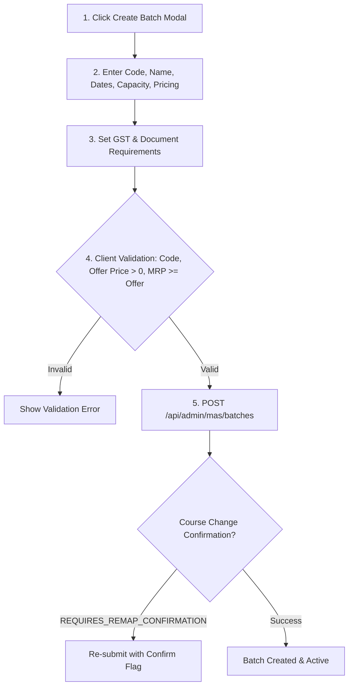

# Component Specification: Batch Management & Student Overrides

## 1. Overview
A **Batch** represents a student cohort moving through a program together. The **Batch Management Engine** handles batch configuration, pricing structure, document submission requirements, batch leads/mentors, cohort analytics, and per-student course overrides.

---

## 2. Batch Entity Attributes (`Batch.ts`)

| Attribute | Data Type | Description |
| :--- | :--- | :--- |
| `code` | string (unique) | Unique identifier (e.g., `"MAS101_OCT2026"`), auto-uppercased |
| `name` | string | Display cohort title (e.g., `"Data Analytics Accelerator - Oct Batch"`) |
| `courseId` | string (nullable) | Default Classic Course assigned to batch (or `null` for Independent Batch) |
| `status` | enum | Cohort status (`upcoming`, `active`, `completed`, `cancelled`) |
| `startDate` / `endDate` | date | Official cohort duration |
| `maxStudents` | integer | Capacity slider (default `50`, step `10`) |
| `enrollmentFee` | decimal | Offer price (required `> 0`) |
| `originalPrice` | decimal | MRP / List price (must be `≥ enrollmentFee`) |
| `gstEnabled` / `gstPercent` | boolean / decimal | Tax configuration |
| `requiresDocuments` | boolean | Requires student compliance uploads (Aadhaar, College ID, Resume) |
| `bannerImageUrl` | string | Cohort banner image URL |
| `assignedModuleIds` | string[] | Array of module IDs enabled for cohort |
| `batchLeadId` / `cmId` | string | Assigned Batch Lead / Community Manager |
| `superMentorId` | string | Lead Super Mentor assigned to cohort |
| `whatsappLinks` | json | Official student WhatsApp group invite links |
| `roadmapNotes` | json | Per-roadmap-item session notes and attachments |

---

## 3. Cohort Creation Workflow

---

## 4. Per-Student Course Overrides

> [!IMPORTANT]
> **Flexibility Feature**: While a Batch has a default assigned course (`Batch.courseId`), administrators can override the course assignment for individual students via `assignCourseToApplication(applicationId, courseId)`.
> 
> As a result, **students in the exact same batch can follow completely different learning plans, video courses, and test roadmaps**.

---

## 5. Cohort Analytics & Excel Export
Admin dashboard views (`BatchKPISection.tsx`, `BatchDetailView.tsx`) provide cohort metrics:
- Total enrolled student headcount.
- Total mentor connects completed.
- Total tokens consumed by cohort.
- Revenue generated (gross & net after GST).
- Per-student breakdown tables with **Excel (.xlsx) export** capabilities (`GET /api/admin/dashboard/batch/:batchName/students`).
