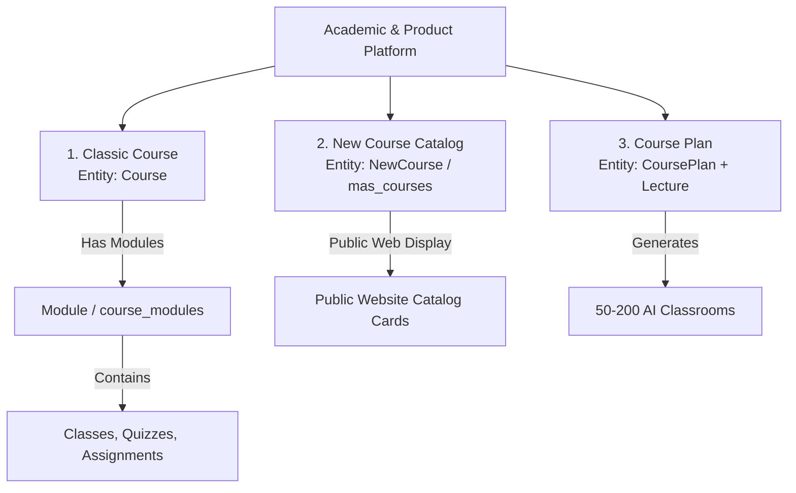

# Component Specification: Courses, Modules & AI Classrooms

## 1. Overview
The platform manages learning content across three distinct course tiers: **Classic Courses** (structured roadmap programs), **New Courses** (marketing catalog items), and **Course Plans** (AI-generated lecture series). Courses are subdivided into **Modules** containing classes, quizzes, and assignments.

---

## 2. Three Course Concepts

### 2.1 Classic Course (`Course.ts`)
- **Purpose**: The primary academic program structure followed by enrolled students.
- **Attributes**: Roadmap JSON (`roadmapItems`), schedule unit (`'week'`), custom step types.
- **Admin UI**: `admin/mas/courses/page.tsx` & Course Builder.

### 2.2 New Course Marketing Catalog (`NewCourse.ts` in `mas_courses` table)
- **Purpose**: Catalog cards displayed on the public marketing website (`myanalyticsschool.com`).
- **Attributes**: Course slug, marketing tags, pricing tiers, badges-as-labels, highlights.
- **Admin UI**: `admin/mas/new-courses/page.tsx`.

### 2.3 Course Plan for AI Classrooms (`CoursePlan.ts`)
- **Purpose**: Multi-lecture syllabus structure generated via AI.
- **Output**: Powers **50 to 200 interactive AI Classrooms** for self-paced student learning.
- **Admin UI**: `admin/mas/course-plans/page.tsx`.

---

## 3. Modules (`course_modules` Entity)

Modules represent distinct learning chapters inside a Classic Course.

### 3.1 Entity Structure (`Module.ts`)
- `id` (PK, UUID)
- `courseId` (FK to Course, CASCADE delete)
- `title` (string)
- `moduleOrder` (integer)
- `totalClasses` / `totalQuizzes` / `totalAssignments` (counters)

### 3.2 Module Assignment to Cohort Batches
- Admins can assign specific subsets of modules to a batch via `Batch.assignedModuleIds[]`.
- Modules can be reordered visually within the Course Builder integration screen.
