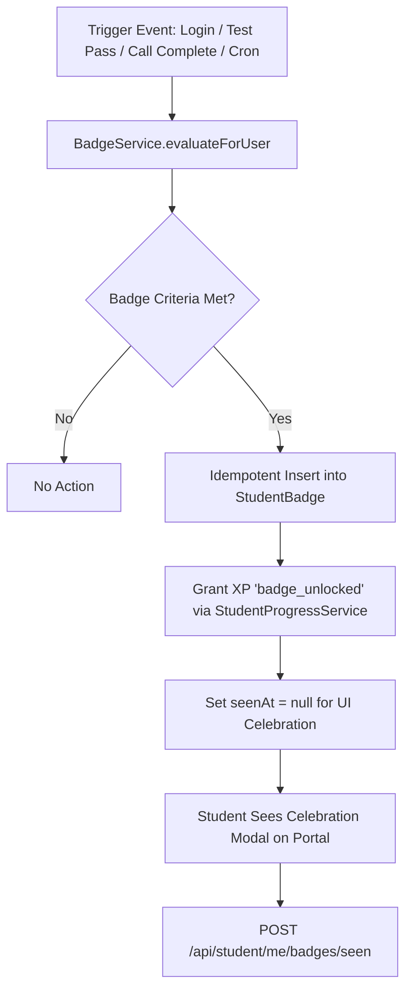

# Component Specification: Gamification Engine (XP, Levels, Streaks & Badges)

## 1. Overview
The **Gamification Engine** is designed to drive continuous student engagement, daily platform visits, and course completion. By rewarding learning behaviors with **Experience Points (XP)**, **5 Tier Levels**, **Daily Streaks**, and **Achievement Badges**, the engine transforms academic progress into a rewarding experience.

---

## 2. Core Mechanics

### 2.1 XP (Experience Points) & Ledger
- Every gamified student action logs an append-only transaction in the `XpEvent` ledger (`src/entities/XpEvent.ts`).
- Deduplication prevents duplicate XP exploitation via unique constraint `(userId, type, sourceId)`.
- Base rules and multipliers are governed by `src/config/xpRules.ts`.

### 2.2 5-Level Progression Tiers
Accumulated total XP automatically upgrades the student across 5 defined levels:

| Level | Level Name | Required Total XP Range |
| :--- | :--- | :--- |
| **Level 1** | Novice / Explorer | `0 – 199 XP` |
| **Level 2** | Learner | `200 – 599 XP` |
| **Level 3** | Achiever | `600 – 999 XP` |
| **Level 4** | Scholar | `1000 – 1999 XP` |
| **Level 5** | Master | `2000+ XP` |

### 2.3 Daily Streaks & "On Fire" Status
- **Streak Calculation**: Evaluates daily login events. Showing up daily builds `currentStreak`.
- **Milestone Rewards**: Every 7 consecutive days unlocks a bonus XP multiplier/reward.
- **On Fire Today Flag**: Returned in `/api/student/me/progress` as `isOnFireToday: boolean` once daily actions are recorded.

---

## 3. Achievement Badges (6 Starter Badges)

Badges are statically defined in `src/config/badges.config.ts` and evaluated by `BadgeService.ts`:

| Badge ID | Badge Name | Icon | Unlock Criterion | XP Reward |
| :--- | :--- | :--- | :--- | :---: |
| `first_step` | **Explorer** | 🧭 | First daily login after onboarding | `25 XP` |
| `profile_pro` | **All Star** | ⭐ | Completing 100% of user profile (`isProfileComplete`) | `25 XP` |
| `week_warrior` | **Momentum** | 🔥 | Achieving a daily streak of `≥ 7 days` | `50 XP` |
| `test_taker` | **Achiever** | 📝 | Passing first Mr Test exam with `≥ 50%` score | `50 XP` |
| `mentor_connector` | **Collaborator** | 🤝 | Completing first 1-on-1 mentor call session | `50 XP` |
| `module_master` | **Scholar** | 🎓 | Finishing first complete course module in Mr Learn | `50 XP` |

---

## 4. Badge Evaluation & Unlock Workflow

---

## 5. Entity Models & Database Schema

### `StudentProgress` (`default` schema)
- `userId` (PK, UUID)
- `totalXp` (integer)
- `level` (integer, 1–5)
- `currentStreak` (integer)
- `longestStreak` (integer)
- `lastActiveDate` (date)

### `StudentBadge` (`default` schema)
- `id` (PK, UUID)
- `userId` (FK to User)
- `badgeId` (string, e.g., `'week_warrior'`)
- `unlockedAt` (timestamp)
- `seenAt` (nullable timestamp)
- **Constraint**: `UQ_STUDENT_BADGE (userId, badgeId)` guarantees idempotent unlocks.

---

## 6. Background Workers & Evaluation Triggers
- **Real-time Triggers**:
  - `auth.controller.ts`: Evaluates login badges (`Explorer`, `Momentum`).
  - `SlotCompletionService.ts`: Evaluates `Collaborator` upon session completion.
  - `MrTestSyncService.ts`: Evaluates `Achiever` when exam score syncs.
- **Scheduled Cron Worker**:
  - `badgeEvaluation.worker.ts`: Runs periodically over all active batch users (`ENROLLED`, `BATCH_ALLOCATED`, `PAID`) with page sizes of 200 users to evaluate asynchronous criteria (`Scholar`, `All Star`).

---

## 7. Disambiguation Note
> [!NOTE]
> The gamification badges (`src/config/badges.config.ts`) are separate from:
> 1. `PredictedInterestBadge.tsx` used in the Sales CRM to show lead temperature.
> 2. `NewCourse.metadata.badges` used as text labels on public marketing cards.
> 3. `@/components/ui/badge` standard UI UI components (shadcn/ui).
