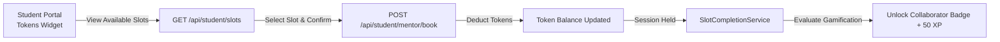

# Component Specification: Mentorship & Mentor Experience Engine

## 1. Overview
The **Mentorship & Mentor Experience Engine** powers 1-on-1 human guidance, mock interviews, and career support across the MAS Mentor Platform. It manages mentor availability, student token balances, slot booking, session completion validation, student feedback, and mentor leaderboard rankings.

---

## 2. Core Mechanisms

### 2.1 Student Token Credit System
- Students receive a quota of **Tokens** upon enrolling in a batch program.
- Booking a 1-on-1 session deducts credits from the student's token balance.
- Additional tokens can be requested/purchased via the student portal (`/api/student/tokens/*`).

### 2.2 1-on-1 Call Booking Flow

### 2.3 Session Completion & Gamification
- When a mentor completes a scheduled slot, `SlotCompletionService.ts` executes.
- Marks session as completed and evaluates gamification rules.
- Triggers the **Collaborator Badge** (`mentor_connector`) for the student's first completed call, granting `+50 XP`.

### 2.4 Mentor Dashboard & Leaderboard
- Mentors log into `mr-mentor-frontend` to set availability, view assigned meetings, add student call notes, and track performance.
- Mentors are ranked on a public/admin **Mentor Leaderboard** (`leaderboard/`) based on student rating, session volume, and feedback consistency.

---

## 3. Value Proposition
- **High Accountability**: Tokens ensure students value 1-on-1 mentor time and reduce no-shows.
- **Outcome Focus**: Mentors provide personalized career coaching, resume reviews, and mock technical interviews to drive job placement.
