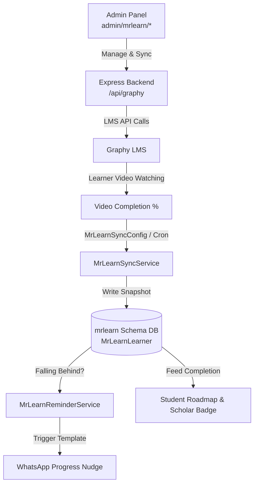

# Component Specification: Mr Learn — Video Learning Engine (Graphy LMS Integration)

## 1. Overview
**Mr Learn** is the video course and Learning Management System (LMS) integration console for the MAS Mentor Platform. It connects MAS to an external specialist LMS platform (**Graphy** via `/api/graphy`). It handles video course mapping, learner progress synchronization, new-student auto-enrolment, and automated WhatsApp progress reminders.

---

## 2. System Architecture & Progress Loop

---

## 3. Core Features

### 3.1 Course & Learner Management
- Browse video courses, manage enrolled learners, and review question banks (`admin/mrlearn/`).
- Push MAS students into Graphy LMS as learners (`POST /api/graphy/sync/students/seed-all-missing`).

### 3.2 Learner Progress Sync (`mrlearn` schema)
- `MrLearnCourse`: Synchronized course metadata.
- `MrLearnLearner`: Tracks individual student completion (`progressPercentage`, completion status, raw JSON report).
- `MrLearnSyncConfig`: Sets sync interval (e.g., default 168 hours / 7 days).

### 3.3 Automated WhatsApp Progress Reminders
- System detects students who are falling behind on video milestones.
- `MrLearnReminderService` triggers automated WhatsApp messages using the template `mrlearn_course_progress_reminder`.
- Execution details logged in `MrLearnReminderLog`.

### 3.4 New-Student Auto-Sync Cron Job
- `new-student-cron`: Periodically scans newly enrolled MAS applications and automatically provisions learner accounts inside Graphy without manual admin intervention.

### 3.5 Gamification Integration
Completing the first video course module unlocks the **Scholar Badge** (`module_master`) and grants `+50 XP`.
