# Component Specification: Mr Test — Assessment Engine (EzExam Integration)

## 1. Overview
**Mr Test** is the exam and assessment engine console of the MAS Mentor Platform. Rather than building a separate testing engine from scratch, Mr Test serves as an integration console connecting MAS to an external specialist examination platform (**EzExam** at `myanalyticsschool.ezexam.in`). It synchronizes exam series, pushes student accounts, pulls test results back into student records, and gates exams behind required course completion.

---

## 2. System Architecture & Sync Flow

```mermaid
flowchart LR
    ADMIN[Admin Panel\nadmin/mrtest/*] -->|Browse & Sync Config| BE[Express Backend\n/api/ezexam]
    BE -->|REST API Proxy| EZ[EzExam Portal\nmyanalyticsschool.ezexam.in]
    
    EZ -->|Student Test Submission| SUB[Exam Results & Percentages]
    SUB -->|MrTestSyncConfig Cron / Manual Run| SYNC[MrTestSyncService]
    SYNC -->|Write Snapshot| DB[(mrtest Schema DB\nMrTestSubmission)]
    
    DB -->|Feed Progress| STU[Student Roadmap & Achiever Badge]
```

---

## 3. Key Functionalities

### 3.1 Live Exam Catalog & Proxy
- Admins browse live online exams (`GET /api/ezexam/online-exams`).
- Admins push MAS student records into EzExam as test-takers (`POST /api/ezexam/students/create-mas-account`).

### 3.2 Exam Sync Engine (`mrtest` schema)
- `MrTestSyncConfig`: Configures periodic synchronization per exam (interval, batch, enabled status).
- `MrTestSubmission`: Stores synced summary results (score, percentage, rank, pass/fail status).
- `MrTestSubmissionReport`: Stores itemized question-level performance breakdowns.
- `MrTestSyncRun`: Audit log recording sync execution timestamps and record counts.

### 3.3 Batch Roadmap Attachment & Prerequisite Gating
Admins attach exams to roadmap items via `BatchMrTestExam`:
- `batchId` + `roadmapItemId` → `mrTestExamId`.
- **Prerequisite Locking**: Admins can require a student to complete a video course (`prerequisiteCourseId`) hitting a minimum threshold (e.g., `prerequisiteThreshold = 75%`) before the exam link (`takeUrl`) unlocks.

### 3.4 Gamification Integration
Passing a batch-attached Mr Test exam with `≥ 50%` score triggers the **Achiever Badge** (`test_taker`) and awards `+50 XP`.
