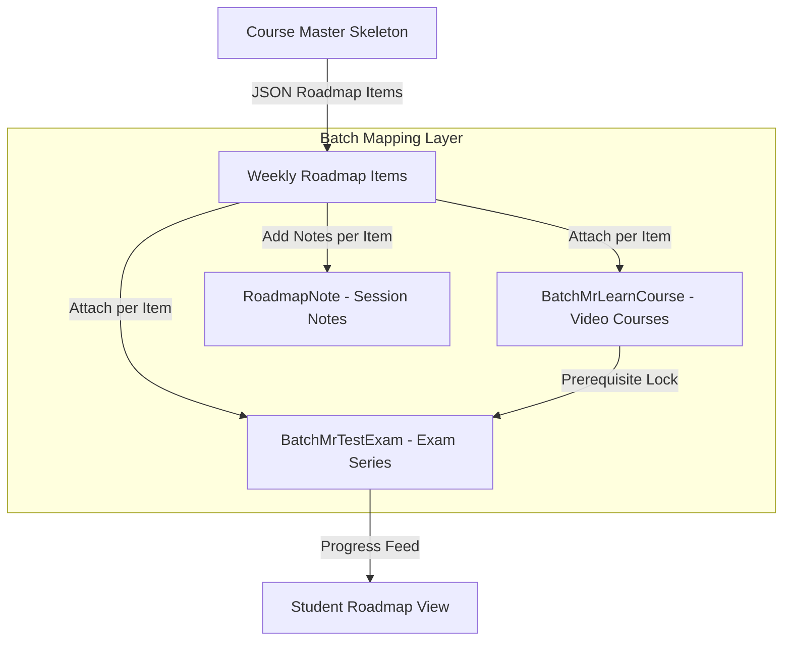

# Component Specification: Roadmap Architecture & Course Builder

## 1. Overview
The **Roadmap Engine & Course Builder** is the curriculum authoring and mapping core of the MAS Mentor Platform. It allows administrators to construct weekly learning pathways (roadmaps) for courses and visually map external video content (Mr Learn / Graphy), assessments (Mr Test / EzExam), live classes, and session notes directly onto cohort roadmaps.

---

## 2. Core Concepts & Data Models

### 2.1 Course Entity Storage (`Course.ts`)
The course roadmap is stored as structured JSON directly on the `Course` entity:
- `roadmapItems`: Array of `RoadmapItem` objects.
- `roadmapScheduleUnit`: Defines grouping granularity (`'week'`, `'day'`, `'session'`, or `'step'`).
- `roadmapCustomTypes`: Array of admin-defined custom step types.

### 2.2 Roadmap Item Schema

```typescript
type RoadmapItem = {
  id: string;
  order: number;
  weekNumber: number;
  type: RoadmapStepType;
  title: string;
  description?: string;
  thumbnailUrl?: string;
  thumbnailS3Key?: string;
  links?: { title: string; url: string }[];
  attachments?: { name: string; url: string; s3Key: string }[];
};
```

### 2.3 Built-In Step Types

| Type Code | Emoji | Name | Description |
| :--- | :---: | :--- | :--- |
| `MODULE` | 📘 | **Module** | Video course or primary learning module |
| `TEST` | 📝 | **Test** | Assessment or mock examination |
| `ASSIGNMENT` | ✏️ | **Assignment** | Hands-on project/submission work |
| `LIVE_CLASS` | 🎥 | **Live Class** | Scheduled interactive live session |
| `WEBINAR` | 🎙️ | **Webinar** | Guest talk or industry webinar |
| `PROJECT` | 🚀 | **Project** | Capstone or milestone project |
| `MILESTONE` | 🏁 | **Milestone** | Key achievement marker or checkpoint |

*Note: Admins can define custom step types with bespoke labels, emojis, and colors.*

---

## 3. Course Builder & Batch Mapping Architecture

The **Course Builder** (`admin/mas/course-builder/page.tsx`) acts as the integration workbench. While the Course defines the baseline roadmap skeleton, the Batch enriches each step with concrete platform assets:



### 3.1 Mapping Tables
- `BatchMrLearnCourse`: Links `batchId` + `roadmapItemId` → `mrLearnCourseId` (Graphy LMS).
- `BatchMrTestExam`: Links `batchId` + `roadmapItemId` → `mrTestExamId` (EzExam) with optional `prerequisiteCourseId` and `prerequisiteThreshold` (e.g., 75%).
- `Batch.roadmapNotes`: JSON object storing batch-specific session notes and instructor files keyed by `roadmapItemId`.

---

## 4. Key Authoring Capabilities

### 4.1 Visual Drag-and-Drop (`@dnd-kit`)
- Admin reordering automatically re-stamps item `.order` indices.
- Items are logically grouped into collapsible week cards.
- Adding a new step auto-assigns `weekNumber = max(weekNumber) + 1`.

### 4.2 Single & Bulk JSON Import
- Admins can import single or multiple course roadmaps at once via `JsonImportModal.tsx`.
- Supports bulk payloads containing up to **50 courses** in a single operation.
- Validates required fields (`title`, positive integer `weekNumber`); defaults missing/unknown types to `MILESTONE`.

### 4.3 Asset Staging & S3 Uploads
- Thumbnails and file attachments are staged locally in client state during editing.
- Files are uploaded to AWS S3 in bulk upon saving the course (`/api/admin/mas/courses/:id/roadmap/upload`), returning CDN URLs via CloudFront.

---

## 5. Student API Resolution

When a student requests their roadmap via `GET /api/student/batches/:batchId/roadmap`:
1. System resolves the target course (`Application.courseId` override or `Batch.courseId`).
2. Fetches roadmap items and merges batch-specific attachments (`mrLearnByItem`, `mrTestByItem`, `notes`).
3. Computes per-student exam unlock states based on prerequisite completion thresholds.
4. Returns consolidated json payload to power the student dashboard view.
