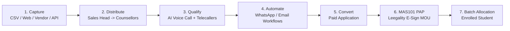

# Component Specification: Sales CRM & Aarya AI Calling Engine

## 1. Overview
The **Sales CRM & Aarya AI Engine** automates student acquisition from initial lead capture through automated AI qualification, sales representative follow-ups, and enrollment into academic batches. It includes native CRM lead bucketing, automated nurture workflows, and an ElevenLabs-powered AI voice agent named **"Aarya"**.

---

## 2. Lead Lifecycle & Lifecycle Buckets

Leads progress through distinct lifecycle stages tracked in `RawLead` (`src/entities/RawLead.ts` in `mas_crm` schema):

### 2.1 Lead Qualification Temperature
- **Hot**: High engagement / high intent (e.g., long AI call duration).
- **Warm**: Moderate interest / follow-up requested.
- **Cold**: Low engagement / uncontacted.

---

## 3. Aarya AI Voice Agent (ElevenLabs Integration)

**Aarya** is an automated AI voice calling agent used for bulk lead qualification and outreach.

### 3.1 AI Calling Workflow
1. Sales admin creates a call batch via `CreateAaryaBatchModal.tsx`.
2. Backend triggers ElevenLabs voice agent calls for selected leads.
3. `aaryaSync.worker.ts` polls ElevenLabs every 15 minutes to retrieve call transcripts and duration.
4. System automatically computes `RawLead.predictedInterestLevel` based on call duration:

| Call Duration | Predicted Interest Chip |
| :--- | :--- |
| `≥ 30 seconds` | 🔥 **Hot** |
| `≥ 10 seconds` | ☀️ **Warm** |
| `> 0 seconds` | ❄️ **Cold** |

5. Interest chips display directly on sales CRM cards (`PredictedInterestBadge.tsx`) to prioritize telecaller outreach.

---

## 4. Automated Sales Nurture Workflows

Admins build visual automation sequences using a React Flow workflow builder (`WorkflowBuilder.tsx`):
- **Triggers**: Lead status change, new lead capture, or campaign tag.
- **Actions**:
  - `aaryaCall`: Trigger AI voice call.
  - `branch`: Split workflow based on Aarya call interest (Hot vs. Warm/Cold).
  - `sendWhatsApp`: Send automated WhatsApp message via Graphy/vendor gateway.
  - `sendEmail`: Trigger nurturing email.
  - `wait`: Pause execution for defined duration.
- **Worker**: `workflow.worker.ts` scans active workflow enrollments every 5 minutes.

---

## 5. MAS101 Pay-After-Placement (PAP) Agreement Workflow

For flagship outcome-based programs, converted leads enter the **MAS101 PAP Workflow** (`Mas101PapWorkflow` entity):
1. **Pending MOU Details**: Admin verifies student background & financial documents.
2. **Pending MOU Upload / Generation**: Agreement generated via template (`Mas101PapAgreementTemplate`).
3. **Leegality E-Sign**: Digital MOU sent to student for legal e-signature via Leegality integration.
4. **MOU Signed & Approved**: Document verified and stamped.
5. **Enrolled**: Student officially assigned to cohort batch.

---

## 6. Primary Data Entities (`mas_crm` schema)
- `RawLead`: Main CRM lead record (source, counsellor assignment, follow-up dates, call logs).
- `CampaignLead`: Marketing campaign funnel leads.
- `VendorLead`: External vendor leads mirrored to `RawLead`.
- `AaryaCallBatch`: Logs batch AI call dispatches.
- `Mas101PapWorkflow`: Tracks PAP legal agreement states.
- `LeadActivityLog`, `LeadCallLog`, `LeadWhatsAppLog`: Audit trails.
