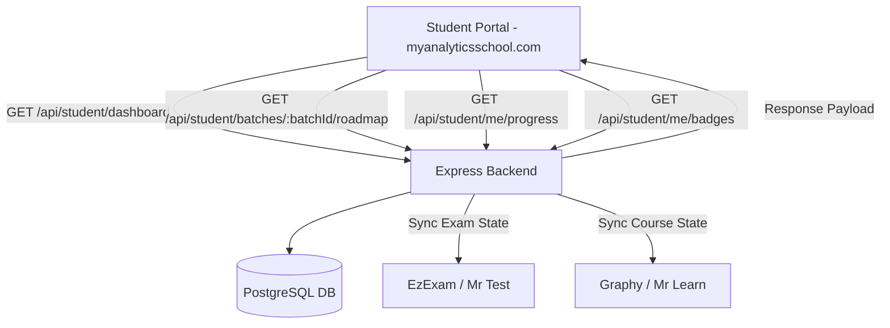

# Component Specification: Student Dashboard & Learning Portal

## 1. Overview
The **Student Dashboard & Learning Portal** is the central student-facing interface of the MAS (My Analytics School) Mentor Platform. It provides a structured, gamified, and interactive learning environment where enrolled students track their weekly roadmap, watch video courses, attempt assessments, attend live sessions, book 1-on-1 mentor calls, and monitor placement milestones.

---

## 2. Core Features & UI Breakdown

### 2.1 Navigation Sidebar
The student portal features a dedicated sidebar navigation menu:
- **Dashboard**: High-level overview of progress, announcements, and upcoming sessions.
- **Roadmap**: Chronological, week-by-week learning plan assigned to the student's cohort.
- **My Courses**: Video courses (via Mr Learn / Graphy) assigned to the student.
- **Quizzes**: Interactive quizzes and practice question sets.
- **AI Classroom**: Interactive 50–200 AI-led lesson modules.
- **Mentor Calls**: Slot selection and booking for 1-on-1 mentorship sessions.
- **Badges**: Earned and locked gamification badges and achievement history.
- **Tokens**: Token balance, credit transaction ledger, and mentor call booking trigger.
- **My Applications**: Application status, placement tracking, and Pay-After-Placement (MAS101 PAP) agreement workflow.

### 2.2 Progress & Gamification Ribbon
Positioned prominently at the top of the student view:
- **Level Chip**: Student's current level (Levels 1 to 5).
- **XP Counter**: Accumulated Experience Points (e.g., `1,250 XP`).
- **Streak Tracker**: Consecutive active daily logins (e.g., `7 Day Streak`).
- **On Fire Today Indicator**: Visual cue displayed when daily login/learning actions are completed.

### 2.3 Weekly Roadmap View
The core of the student journey, organized by schedule units (typically **Week 1 to Week 12**):
- **Step Cards**: Displays step type icons (Module 📘, Test 📝, Assignment ✏️, Live Class 🎥, Webinar 🎙️, Project 🚀, Milestone 🏁).
- **Item Progress**: Percentage completion bar per item (e.g., `Data Cleaning & Preparation - 80%`).
- **Prerequisite Locking**: Items (e.g., tests) locked until required prerequisite courses hit completion thresholds (e.g., ≥75% course completion).
- **Session Notes**: Per-item instructor notes, links, and attachments.
- **Join/Launch Actions**: Direct CTA buttons to launch video courses, open exam portals, or join live classes (e.g., `Sat, 24 May • 7:00 PM [Join]`).

### 2.4 Learning Support Widgets
- **Today's Review (Smart Spaced Repetition)**: Highlights topics due for review (e.g., `2 topics due for review [Start Review]`).
- **Tokens Widget**: Displays available token balance (e.g., `120 Available [Book Mentor Call]`).
- **Badges Preview**: Displays recent achievement badges (Explorer, All Star, Momentum, Achiever, Collaborator, Scholar) with a `View All` action.

---

## 3. Architecture & Data Flow

---

## 4. Per-Student Roadmap Customization

> [!IMPORTANT]
> **Key Architectural Nuance**: Although students are grouped into a single **Batch**, two students in the exact same batch can follow **different courses and roadmaps**. The system resolves roadmap requests by checking `Application.courseId` first, falling back to `Batch.courseId` as default.

---

## 5. API Surface

| Method | Endpoint | Description |
| :--- | :--- | :--- |
| `GET` | `/api/student/dashboard` | Main dashboard payload (enrollments, announcements, status) |
| `GET` | `/api/student/batches/:batchId/roadmap` | Cohort/student-specific weekly roadmap with progress |
| `GET` | `/api/student/me/progress` | User XP, level, streak, blocking axis, and unseen badges |
| `GET` | `/api/student/me/badges` | Complete list of earned & available achievement badges |
| `POST` | `/api/student/me/badges/seen` | Acknowledges badge celebration modal |
| `GET` | `/api/student/quizzes*` | Fetches assigned practice quizzes |
| `GET` | `/api/student/ai-classrooms*` | Accesses AI-generated multi-lecture classrooms |

---

## 6. Key Value Talking Points
- **Single Source of Truth**: Eliminates scattered links; everything lives in one structured weekly plan.
- **Outcome Gating**: Students cannot rush into exams without finishing foundational video modules.
- **High Retention**: Integrated daily review, tokens, and streak mechanisms keep drop-off rates low.
