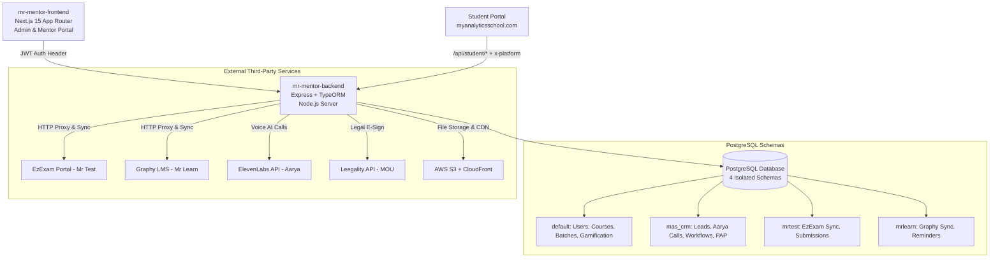

# Component Specification: System Architecture, Database Schemas & API Layer

## 1. Overview
This document specifies the technical architecture, multi-schema PostgreSQL structure, background worker system, third-party service integrations, and API route hierarchy of the MAS (My Analytics School) Mentor Platform.

---

## 2. High-Level System Architecture

---

## 3. Database Schemas (`mr-mentor-backend/src/entities/`)

The platform utilizes a multi-schema PostgreSQL configuration:

### 3.1 `default` Schema
- **Core Platform**: `User`, `Course`, `Batch`, `Module`, `Enrollment`, `Application`.
- **Gamification**: `StudentBadge`, `StudentProgress`, `XpEvent`.
- **Batch Overlays**: `BatchMrLearnCourse`, `BatchMrTestExam`.

### 3.2 `mas_crm` Schema
- **Sales & Acquisition**: `RawLead`, `CampaignLead`, `VendorLead`, `LeadTag`, `LeadFollowUp`, `LeadActivityLog`, `LeadCallLog`, `LeadWhatsAppLog`.
- **AI Calling & Automation**: `AaryaCallBatch`, `WorkflowEnrollment`, `Mas101PapWorkflow`, `Mas101PapAgreementTemplate`.

### 3.3 `mrtest` Schema
- **EzExam Mirror**: `MrTestSyncConfig`, `MrTestOnlineExam`, `MrTestSubmission`, `MrTestSubmissionReport`, `MrTestSyncRun`.

### 3.4 `mrlearn` Schema
- **Graphy LMS Mirror**: `MrLearnCourse`, `MrLearnLearner`, `MrLearnSyncConfig`, `MrLearnSyncRun`, `MrLearnLearnerReport`, `MrLearnReminderLog`, `MrLearnAuthCredentials`.

---

## 4. Background Workers & Cron Schedule

| Worker File | Interval / Schedule | Purpose |
| :--- | :--- | :--- |
| `badgeEvaluation.worker.ts` | Periodic batch cron | Evaluates asynchronous gamification criteria over active students |
| `aaryaSync.worker.ts` | Every 15 minutes | Polls ElevenLabs for AI call transcripts, durations & computes interest level |
| `workflow.worker.ts` | Every 5 minutes | Scans active lead automation workflow nodes and advances state |
| `leadAutoAssignment.worker.ts` | Every 15 minutes | Auto-assigns new unassigned leads to telecallers |
| `mrlearnReminder.worker.ts` | Weekly (default 168h) | Sends WhatsApp progress nudges to falling-behind learners |
| `newStudentCron.worker.ts` | Configurable cron | Auto-seeds newly enrolled MAS students into Graphy LMS |

---

## 5. API Layer & Route Hierarchy (`src/routes/index.ts`)

| Route Prefix | Controller / Service | Target Audience | Key Responsibilities |
| :--- | :--- | :--- | :--- |
| `/api/sales` | `sales.controller.ts` | Admin / Sales | Applications, lead pipeline, discounts, PAP legal workflow |
| `/api` | `rawLead`, `aarya`, `workflow` | Admin / Sales | Raw leads, Aarya AI dispatches, workflow engines |
| `/api/batchlead` | `batchLead.controller.ts` | Admin / Sales | Cohort lead management |
| `/api/graphy` | `graphyLms.controller.ts` | Admin Console | Mr Learn (Graphy LMS) catalog, learner sync & reminders |
| `/api/ezexam` | `ezexam.controller.ts` | Admin Console | Mr Test (EzExam) exams, test-taker creation & score sync |
| `/api/admin/mas/*` | `adminMas.controller.ts` | Admin Console | Courses, roadmaps, batches, modules, course builder |
| `/api/student/*` | `student.controller.ts` | Student Portal | Student dashboard, weekly roadmap, progress, badges, quizzes |

---

## 6. Security & Environmental Configuration
- **Auth Flow**: JWT-based session tokens (`session.backendToken`). Admin endpoints gated by `authMiddleware` + `adminMiddleware`.
- **Multi-Platform Dispatch**: Multi-platform header `x-platform` identifies student portal requests vs. admin requests.
- **Secrets Isolation**: EzExam, Graphy, ElevenLabs, and Leegality API keys stored strictly in environment variables or encrypted `MrLearnAuthCredentials` / `MrTestSyncConfig` tables.
