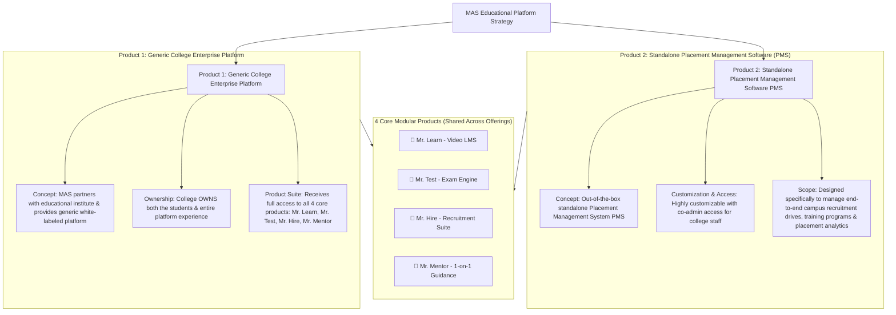

# Daily Log: 2026-08-12 (Day 03)

## 📌 Day Focus Area
Admin Dashboard & CRM Overview with Shubham + Exploration & Formulation of the 2 Product Positions.

---

## 🔍 Key Discussions & Exploration (Meeting with Shubham)

### 1. Admin Dashboard & Sales CRM Review
- **Overview with Shubham**: Reviewed the internal Admin Panel (`/admin/*`) and Sales CRM (`/admin/mas/sales/*`).
- **Key Operational Findings**:
  - *Student Onboarding Journey*: Rigid, hardcoded around specific college tiers (IIT vs. Non-IIT) and internal courses (**MAS101** vs. **MAS102**).
  - *Student Dashboard*: Hardcoded for MAS internal data/business analytics programs.

---

## 🎯 The 2 Envisioned Product Positions (Day 03 Outcome)

During Day 03, the team explored and formulated **two distinct strategic product positions** to evaluate moving forward:

### Product 1: Generic College Enterprise Platform
* **Concept**: MAS partners with an educational institute and provides a generic, white-labeled platform.
* **Ownership**: The college owns both the students and the entire platform experience.
* **Product Suite**: The college receives full access to all 4 core products (**Mr. Learn**, **Mr. Test**, **Mr. Hire**, **Mr. Mentor**).

---

### Product 2: Standalone Placement Management Software (PMS)
* **Concept**: An out-of-the-box, standalone Placement Management System (PMS).
* **Customization & Access**: Highly customizable with co-admin access for college staff.
* **Scope**: Designed specifically to manage end-to-end campus recruitment drives, student training programs, and placement analytics.

---

## 🧩 The 4 Core Modular Products (Shared Across Both Positions)

1. **📘 Mr. Learn (Video LMS Engine)**: Graphy LMS integration (`/api/graphy`), video course catalog, learner progress sync (`MrLearnLearner`), and automated WhatsApp reminders.
2. **📝 Mr. Test (Assessment Engine)**: EzExam assessment integration (`myanalyticsschool.ezexam.in`), live exam proxy, score sync (`MrTestSubmission`), and prerequisite threshold gating.
3. **💼 Mr. Hire (Recruitment & Placement Suite)**: Campus job drive publishing, candidate application tracking, recruiter portal access, and offer letter tracking.
4. **🤝 Mr. Mentor (1-on-1 Mentorship & Token System)**: Token credit allocation & escrow booking, post-call scorecard settlement (`SlotCompletionService.ts`), +50 XP payout, Collaborator Badge unlock, and Mentor Leaderboard.

---

## 🎯 PM Decisions Made & Rationale
| Decision | Rationale | Impacted Components |
| :--- | :--- | :--- |
| **Formulate Product 1 and Product 2 as Strategic Exploration Positions** | Provides two distinct product positions to present and evaluate during founder alignment (with Gaurav). | Product Strategy & Roadmap |

---

## 📝 Specifications & Information Added
- Updated Day 03 Log with exact definitions of Product 1 and Product 2, the 4 core modular products, and Shubham meeting notes. (Day 03 Closed).

---

## 📌 Explicit Assumptions Made
- None. (Directly reflects user's exact Product 1 & Product 2 definitions.)
