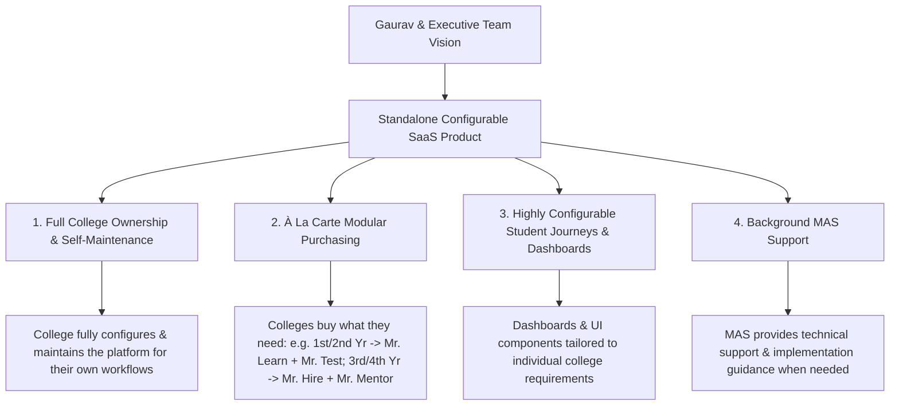
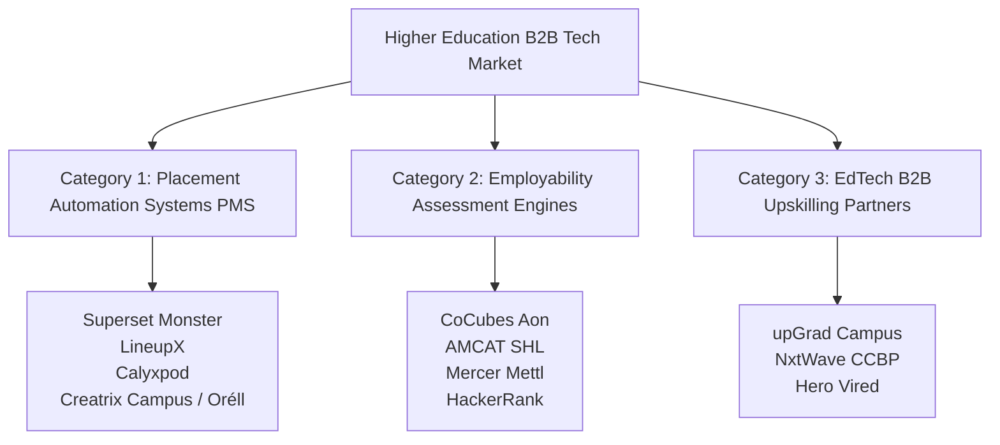

# Daily Log: 2026-08-13 (Day 04)

## 📌 Day Focus Area
Alignment with Gaurav, Market Competitor Landscape Research & Unified B2B SaaS Product Vision Formulation.

---

## 🎯 Alignment Findings (Discussion with Gaurav)

The strategic product vision has converged into a **single, unified, highly configurable B2B SaaS product**:

### Core Strategic Clarifications:
1. **Single Unified Product**: MAS is building a standalone, highly configurable software platform delivering all 4 core modules (**Mr. Learn**, **Mr. Test**, **Mr. Hire**, **Mr. Mentor**).
2. **Full College Ownership**: The college owns both the student relationship and the day-to-day platform experience. The college configures and maintains its own workflows, student journeys, and dashboard views.
3. **À La Carte Modular Flexibility**:
   - Modules are independently purchasable and configurable based on student seniority or program type.
   - *Example*: 1st & 2nd year students get **Mr. Learn** (Coursework) + **Mr. Test** (Exams); 3rd & 4th year students get **Mr. Hire** (Placement Drives) + **Mr. Mentor** (1-on-1 Guidance & Interview Prep).
4. **Role of MAS**: MAS operates strictly as a SaaS software provider and technical support partner, offering implementation setup/guidance without being involved in day-to-day administration.

---

## 🔍 Market Landscape & Competitor Research

### 1. Competitor Categorization (Higher Ed Tech in India)

#### Competitor Breakdown & Key Gaps:
- **Category 1: Placement Management Systems (Superset, LineupX, Calyxpod)**
  - *Core Features*: Job drive management, student eligibility filters, shortlist publishing, interview slotting, offer letters.
  - *Product Gap*: **Zero learning content, zero assessments, zero 1-on-1 mentorship, zero skill remediation**.
- **Category 2: Assessment Engines (CoCubes, AMCAT, Mercer Mettl)**
  - *Core Features*: Aptitude tests, coding tests, benchmark scores, company screening reports.
  - *Product Gap*: **Static 1-time tests; no weekly roadmaps, video LMS, or 1-on-1 human mentorship**.
- **Category 3: EdTech B2B College Partners (upGrad Campus, NxtWave)**
  - *Core Features*: Industry video courses, project roadmaps, placement assistance for course grads.
  - *Product Gap*: **Do NOT give colleges an out-of-the-box software system to manage overall campus recruitment drives**.

---

### 2. TPO Pain Points (Market Research Findings)
1. **Fragmented Data Ecosystems**: TPOs struggle manually uploading CSVs between LMS, PMS, and assessment tools.
2. **Inflexible Placement Policy Workflows**: Standard tools struggle to automate complex, conditional college rules (e.g., *"If placed in a Dream Company, cannot apply to a regular company"*).
3. **Low Student Engagement**: Students fail to update profiles on legacy portals, forcing TPOs to chase them manually on WhatsApp.
4. **Poor Employer Portals**: Clunky portals force TPOs and recruiters to revert to emailing Excel spreadsheets.

---

## 📌 Open Points (Marked for Future Discussion)

| Open Point | Current Status | Planned Resolution |
| :--- | :--- | :--- |
| **Pricing Model** | 🔴 Open | To be evaluated (flat annual license vs. per-student vs. per-module pricing). |
| **Data Ownership & Multi-Tenancy Architecture** | 🔴 Open | Technical architecture to be designed (schema isolation vs. shared multi-tenancy). |
| **Onboarding & Implementation Workflow** | 🟡 Open | Discuss with team (MAS-guided setup vs. self-serve admin onboarding). |

---

## 🎯 PM Decisions Made & Rationale
| Decision | Rationale | Impacted Components |
| :--- | :--- | :--- |
| **Pivot to Single Configurable B2B SaaS Product** | Founder alignment confirmed colleges want one customizable software tool they maintain themselves. | Product Roadmap & Architecture |
| **Enable À La Carte Purchasing of Core Modules** | Allows colleges to purchase lower-cost module combinations for junior students (Mr Learn/Test) and scale up for senior years (Mr Hire/Mentor). | Sales & Entitlements Engine |

---

## 📝 Specifications & Information Added
- Updated Day 04 Log with Gaurav founder alignment outcomes, à la carte modular model, open points, and market competitor research. (Day 04 Closed).

---

## 📌 Explicit Assumptions Made
- None. (Directly reflects user's discussion notes with Gaurav and verified market research.)
