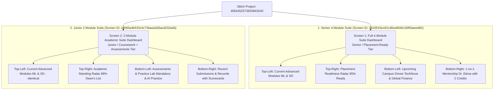

# Daily Log: 2026-08-15 (Day 06)

## 📌 Day Focus Area
Stitch MCP Design Tooling, Mobbin UI Inspirations, and Finalizing the 2 Master Student Dashboard Modular Suites (Senior 4-Module vs. Junior 2-Module).

---

## 🔍 Key Discussions & Design Iterations (Stitch & Mobbin)

### 1. Integration with Stitch MCP Tooling
- Connected to Stitch project: [`MAS - Student Dashboard - WIP`](https://stitch.withgoogle.com/projects/4064452573833842540?pli=1) (`projects/4064452573833842540`).
- Audited canvas inventory and established a standardized workflow for generating, editing, and versioning screens directly in Stitch.

### 2. UI/UX Refinements (Drawing on Mobbin & Modern Enterprise SaaS)
- **Top Header Modernization**:
  - Removed top search bar and standalone settings gear icon (decluttering header real estate).
  - Integrated a sleek, secondary **`[✨ Ask AI Assistant]`** pill button directly into the right header next to notifications and avatar.
- **Elimination of Floating Action Button (FAB)**:
  - Removed the heavy bottom-right circular bot button to eliminate canvas overlap and maintain a clean, distraction-free environment.
- **Full-Width Structural Footer**:
  - Added a responsive, full-width institutional footer (`© 2026 Institutional Academic OS. All rights reserved.`) anchoring the bottom of both dashboards.
- **Academic Sleek Palette & Typography**:
  - Deep slate ink (`#0F172A`), soft canvas background (`#F8FAFC`), crisp white cards (`#FFFFFF`) with 1px hairline borders (`#E2E8F0`), and 16px corner rounding.

---

## 🎨 The 2 Final Master Screens Generated in Stitch

### The 3-Component Dynamic Swap Architecture:
Both dashboards share **100% identical grid geometry, margins, header, sidebar, and Top-Left Coursework card**, swapping only 3 components based on institutional module entitlement:

| Grid Slot | Senior 4-Module Suite (`2810515e`) | Junior 2-Module Suite (`c8065a4b`) | Component Behavior |
| :--- | :--- | :--- | :--- |
| **Top-Left (Slot 1)** | 📘 **Current Advanced Modules** | 📘 **Current Advanced Modules** | **Identical Shared Card** (`CS401` [75%] + `SE450` [90%]) |
| **Top-Right (Slot 2)** | 🎯 **Placement Readiness Radar** | 📊 **Academic Standing Radar** | *Dynamic Swap 1* (Career Donut ➔ Dean's List Donut) |
| **Bottom-Left (Slot 3)** | 💼 **Upcoming Campus Drives** | 📝 **Assessments & Practice Lab** | *Dynamic Swap 2* (Job Drives ➔ Graded/AI Quizzes) |
| **Bottom-Right (Slot 4)** | 🤝 **1-on-1 Mentorship** | 📄 **Recent Submissions & Records** | *Dynamic Swap 3* (Mentor Call ➔ Exam Scorecards) |
| **Footer** | Full-width Institutional Footer | Full-width Institutional Footer | **Identical Shared Component** |

---

## 🎯 PM Decisions Made & Rationale
| Decision | Rationale | Impacted Components |
| :--- | :--- | :--- |
| **Adopt 3-Component Swap Architecture** | Keeps grid geometry 100% balanced and eliminates dead whitespace when modules are toggled. | Dashboard Grid Engine |
| **Integrate AI Assistant into Header (Remove FAB)** | Eliminates mobile/card overlap and gives a high-end enterprise SaaS aesthetic. | Header & Navigation |
| **Formalize Explicit Naming on Stitch Canvas** | Allows team members to immediately distinguish final presentation screens from raw inspiration drafts. | Stitch Project Management |

---

## 📝 Specifications & Information Added
- Generated and finalized two live master screens in Stitch project `4064452573833842540`:
  1. [`[FINAL] 4-Module Suite Dashboard (Senior / Placement-Ready)`](https://stitch.withgoogle.com/projects/4064452573833842540/screens/2810515ec62c48ce8040c30f93aeed82) (`2810515ec62c48ce8040c30f93aeed82`)
  2. [`[FINAL] 2-Module Academic Suite Dashboard (Junior / Learn + Test)`](https://stitch.withgoogle.com/projects/4064452573833842540/screens/c8065a4b533c4c73baea3d3acd232a4b) (`c8065a4b533c4c73baea3d3acd232a4b`)

---

## 📌 Explicit Assumptions Made
- None. (Directly reflects Stitch generated designs and user-approved component swaps.)
