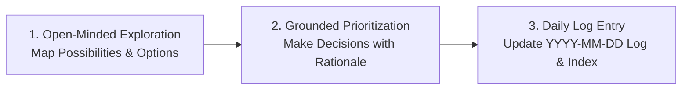

# AI PM Work Log System & Workflow Guide

Welcome to the **AI Product Manager Internship Work Log System** for My Analytics School (MAS). This repository serves as a living audit trail of daily learnings, product explorations, decision logs, user feedback, and specification changes.

---

## 🧭 Core AI PM Working Principles

1. **Zero Unverified Assumptions**: Never assume product details, features, or user intents unless explicitly stated or verified by empirical evidence/stakeholders.
2. **Open-Minded Exploration (Zero Anchoring)**: Do not get stuck in what is currently built in the legacy platform. Explore all product possibilities for creating a world-class, generic educational OS.
3. **Diverge Before Converging**: First explore all potential architectural and feature possibilities, then evaluate and prioritize what to build first based on business goals and user impact.
4. **Auditable & Honest Logging**: Maintain accurate, date-stamped records of discussions, learnings, decisions (with rationale), and open questions.

---

## 🎯 Purpose of the Work Log System
1. **Context Retention**: Preserves complete history across AI sessions so no context or product decision is lost.
2. **PM Knowledge Management**: Provides an easily searchable repository of technical architecture, student & mentor workflows, and product trade-offs.
3. **Internship Progress Tracking**: Serves as a structured record of achievements, learnings, and deliverables during your internship at MAS.

---

## 📋 Recommended Daily PM Workflow

### 1. Daily Entry Creation
- Create a new log file every day using the format: `pm_logs/YYYY-MM-DD_Day_XX_Short_Title.md`.
- Copy the template from [`pm_logs/templates/DAILY_LOG_TEMPLATE.md`](file:///Users/yashvi/Documents/MAS%20-%20AI%20PM/pm_logs/templates/DAILY_LOG_TEMPLATE.md).

### 2. Log Structure Best Practices
- **Focus Area**: Single primary objective for the day.
- **Explorations & Learnings**: Document raw ideas, feature possibilities, and system facts separately.
- **Decisions & Rationale**: Log verified decisions, trade-offs, and components impacted.
- **Open Questions & Assumptions**: Explicitly list items requiring clarification.

---

## 🔗 Quick Navigation
- 📖 [Master Log Index](file:///Users/yashvi/Documents/MAS%20-%20AI%20PM/pm_logs/LOG_INDEX.md)
- 📝 [Daily Log Template](file:///Users/yashvi/Documents/MAS%20-%20AI%20PM/pm_logs/templates/DAILY_LOG_TEMPLATE.md)
- 🏗️ [Platform Components Index](file:///Users/yashvi/Documents/MAS%20-%20AI%20PM/docs/INDEX.md)
