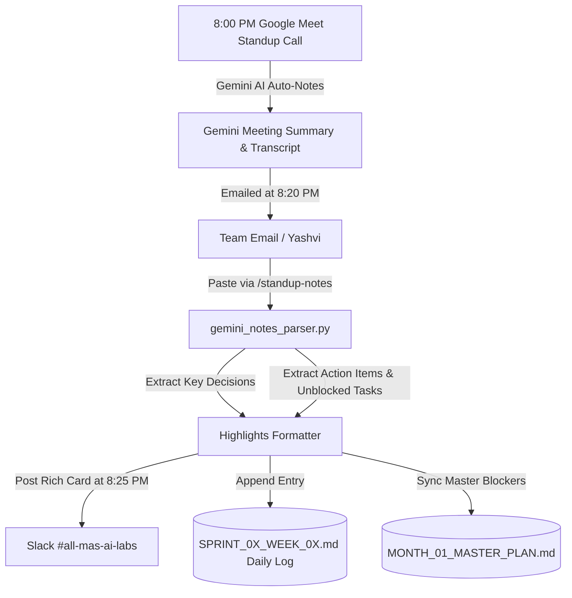

# MAS AI Labs — Automated Slack Standup & Living Sprint Engine
## Technical Specification, Gemini Notes Architecture & Operational Blueprint

**Document Version**: 2.0  
**Target Kickoff**: September 1, 2026  
**Function Head**: Gaurav (CTO) | **AI PM Lead**: Yashvi  
**Main Slack Channel**: `#all-mas-ai-labs`  
**Daily Standup**: 8:00 PM IST (Google Meet) | **Bot Trigger**: 7:00 PM IST  

---

## 📌 1. Executive Summary & Core Objectives

### The Operational Challenge
* **Remote & Dual-Speed Work**: The MAS AI Labs pod works across remote locations with flexible/part-time working schedules.
* **Standup Inefficiency**: Traditional standup calls waste 15–20 minutes on basic status reading ("What did you do today?") instead of deep-dive problem solving and blocker removal.
* **Manual Tracking Overhead**: Daily updates posted in chat threads get lost, resulting in stale sprint documents and zero longitudinal visibility on blockers, delays, and ad-hoc workload creep.

### The Solution: Automated Slack Standup Bot + Google Meet Gemini Integration
An intelligent, lightweight automation engine that:
1. **Eliminates Group Spam**: DMs individual task owners privately at **7:00 PM IST** with *only* their scheduled deliverables for that specific day.
2. **Ultra-Low Friction (< 45s per Person)**: Provides a single-screen consolidated modal with **quick dropdowns** (`Status`, `RAG`) and a 1-line note for blockers.
3. **Pre-Standup Digest**: Aggregates all submissions at **7:45 PM IST** in `#all-mas-ai-labs` highlighting completed deliverables and active blockers in Amber/Red for the 8:00 PM call.
4. **Google Meet Gemini Notes Ingestion**: Ingests automated meeting transcripts/summaries emailed by Google Meet's Gemini AI after the 8:00 PM call, extracts key decisions and action items, broadcasts the official **Day Highlights** to `#all-mas-ai-labs`, and appends them to the active Sprint markdown file.
5. **Living Sprint & Rollover Engine**: Automatically updates `SPRINT_0X_WEEK_0X.md` tables, rolls up active blockers to `MONTH_01_MASTER_PLAN.md`, and moves incomplete tasks to the next sprint during weekend sprint reviews (Saturday/Sunday afternoon).

---

## ⏰ 2. Daily & Weekly Operational Lifecycle

```
┌────────────────────────────────────────────────────────────────────────┐
│                   DAILY SLACK STANDUP TIMELINE                         │
├────────────────────────────────────────────────────────────────────────┤
│ 7:00 PM IST ──► [Automated Personal DMs to Owners]                     │
│                 Bot calculates current day, reads SPRINT_0X_WEEK_0X.md,│
│                 and sends a private DM to each assigned owner.         │
│                                                                        │
│ 7:00–7:40 PM ─► [Teammates Submit Updates (< 45s)]                     │
│                 Teammates submit via single consolidated modal:        │
│                 • Status: [x] Done | [-] In Progress | [!] Blocked     │
│                 • RAG:    🟢 Green | 🟡 Amber | 🔴 Red                 │
│                 • Quick Note: Deliverable PR link / blocker info       │
│                                                                        │
│ 7:45 PM IST ──► [Pre-Standup Digest in #all-mas-ai-labs]               │
│                 Single aggregated summary posted to main channel:      │
│                 • Progress summary (e.g. 5/7 completed)                │
│                 • 🚨 Red/Amber Blockers flagged for call discussion    │
│                 • Direct Google Meet link for 8:00 PM call             │
│                                                                        │
│ 8:00–8:20 PM ─► [Live Standup Call (Google Meet)]                      │
│                 Focused 20-min unblocking call. Google Meet Gemini AI  │
│                 records live transcript, decisions, and action items.  │
│                                                                        │
│ 8:20 PM IST ──► [Google Meet Gemini Notes Received by Email]          │
│                 Gemini AI emails the structured summary & transcript   │
│                 to the team mail ID (e.g. info@masailabs.com / Yashvi).│
│                                                                        │
│ 8:25 PM IST ──► [Gemini Notes Ingested & Day Highlights Published]     │
│                 Command: /standup-notes <paste notes>                  │
│                 Bot extracts key decisions & action items, posts the   │
│                 official Day Highlights to #all-mas-ai-labs, and       │
│                 appends them to the Sprint Doc's Daily Quick Log.      │
│                                                                        │
│ Sat/Sun Aft. ─► [Weekend Living Sprint Rollover & Next Sprint Plan]    │
│                 Command: /sprint-rollover <from_sprint> <to_sprint>    │
│                 Uncompleted/delayed items rolled over to next sprint   │
│                 document as marked [Rollover] tasks.                   │
└────────────────────────────────────────────────────────────────────────┘
```

---

## 🤖 3. Google Meet Gemini Notes Integration Architecture



### Ingestion & Parsing Workflow
1. **Capture**: The Google Meet call has Gemini AI Note-Taking enabled by default. At 8:20 PM IST, Gemini sends an automated email with:
   * **Executive Summary**: Overview of what was discussed.
   * **Decisions**: Formal agreements reached on the call.
   * **Action Items**: Assigned follow-ups with owner names.
2. **Ingestion Engine (`gemini_notes_parser.py`)**:
   * The PM/Lead runs `/standup-notes <paste notes>` (or automated webhook).
   * Regex parsers extract the key decisions, resolved blockers, and action items.
3. **Synchronization**:
   * Generates a visual Slack card posted to `#all-mas-ai-labs`: `📝 Post-Standup Highlights & Decisions (Day X)`.
   * Directly appends the bullet point into the active sprint document under `## 📝 Daily Quick Updates Log`.

---

## ⚡ 4. Complete Slash Commands Specification

| Slash Command | Syntax | Who Uses It | What It Does & Output |
|---|---|:---:|---|
| **`/standup`** | `/standup` | All Teammates | Opens the user's personal 1-screen update modal on demand with their assigned tasks for today. Useful if a teammate wants to update early or missed the 7:00 PM DM. |
| **`/standup-notes`** | `/standup-notes [text]` | Yashvi / Gaurav / Leads | Ingests the Google Meet Gemini notes, parses decisions & action items, posts the Day Highlights to `#all-mas-ai-labs`, and updates the active Sprint document log. |
| **`/sprint-summary`** | `/sprint-summary` | Any Teammate | Generates an instant, on-demand summary card of total sprint progress, completion percentages by compartment, and active blockers. |
| **`/sprint-rollover`** | `/sprint-rollover [from] [to]` *(e.g. `/sprint-rollover 1 2`)* | PM / Tech Lead | Scans previous sprint document for uncompleted tasks, appends them to the new sprint document marked as `[Rollover]`, and logs the rollover action. |
| **`/update-highlights`**| `/update-highlights [text]` | Yashvi / Gaurav | Appends an urgent manual highlight or stakeholder update directly to `#all-mas-ai-labs` and the master plan without waiting for standup. |

---

## 🕒 5. Automated Cron Jobs & Schedulers (`dm_scheduler.py`)

All automated timers run in **Indian Standard Time (IST / `Asia/Kolkata`)** Monday through Friday using `APScheduler`:

```python
# 1. 7:00 PM IST (Mon-Fri) — Dispatch Personalized DMs to Task Owners
scheduler.add_job(
    dispatch_daily_dms,
    "cron",
    day_of_week="mon-fri",
    hour=19,
    minute=0,
    timezone="Asia/Kolkata"
)

# 2. 7:45 PM IST (Mon-Fri) — Post Aggregated Pre-Standup Digest to Main Channel
scheduler.add_job(
    dispatch_channel_digest,
    "cron",
    day_of_week="mon-fri",
    hour=19,
    minute=45,
    timezone="Asia/Kolkata"
)
```

---

## 🧩 6. Codebase Structure & File Responsibilities

```
sprint_execution/slack_automation/
├── slack_bot_app.py         # [Main App] Socket Mode listener, command routing & modal handling
├── block_kit_views.py       # [UI Library] Generates JSON Block Kit cards for DMs, Modals & Summaries
├── sprint_sync_engine.py    # [Markdown Engine] Reads & updates SPRINT_0X.md and Master Plan tables
├── gemini_notes_parser.py   # [Gemini Engine] Ingests and parses Google Meet notes for Day Highlights
├── dm_scheduler.py          # [Scheduler] Cron timer triggering 7:00 PM DMs and 7:45 PM Digest in IST
├── slack_app_manifest.json  # [1-Click Manifest] App configuration for api.slack.com
├── requirements.txt         # [Dependencies] slack-bolt, slack-sdk, python-dotenv, apscheduler
└── .env.example             # [Configuration] Template for tokens, IDs, channels, and meeting links
```

---

## 📋 7. Deployment Checklist & Live Pod Parameters

| Parameter | Configuration Value | Status |
|---|---|:---:|
| **Main Slack Channel** | `#all-mas-ai-labs` | ✅ Confirmed |
| **DM Trigger Time** | `19:00 IST` (7:00 PM) | ✅ Confirmed |
| **Digest Trigger Time** | `19:45 IST` (7:45 PM) | ✅ Confirmed |
| **Live Standup Call** | `20:00 IST` (8:00 PM Google Meet) | ✅ Confirmed |
| **Weekend Rollover Window** | Saturday / Sunday Afternoon | ✅ Confirmed |
| **Google Meet Gemini Notes** | Ingested via `/standup-notes` | ✅ Confirmed |
| **Standup Google Meet Link** | `GOOGLE_MEET_URL` in `.env` | ⏳ Need live link |
| **Slack App Tokens** | `SLACK_BOT_TOKEN` & `SLACK_APP_TOKEN` | ⏳ Need live tokens |
| **Slack Member IDs** | User IDs for Gaurav, Shubham, Rohan, Prakhar, Yashvi | ⏳ Need member IDs |
